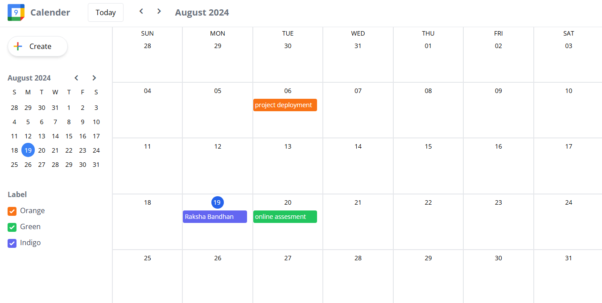
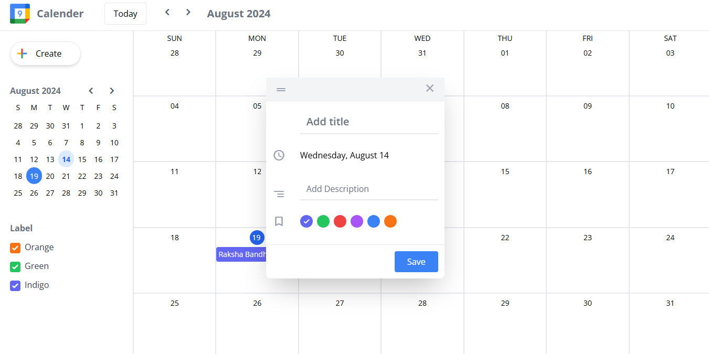

# Calendar App

## Overview

This is a fully functional Calendar App built from scratch using Vite + React, Tailwind CSS, and Day.js. The app provides a seamless user experience similar to Google Calendar, allowing users to manage their events efficiently.

## Features

- **Add Events**: Users can add events to specific dates and times.
- **Update Events**: Existing events can be edited or rescheduled.
- **Delete Events**: Users can remove events they no longer need.
- **Filter Events**: Events can be filtered based on custom labels for easy organization.
- **Persistent Data**: Events are saved in the browser's local storage, ensuring that they remain even after the page is reloaded.

## Tech Stack

- **Vite**: For blazing fast development and optimized builds.
- **React**: For creating interactive and dynamic user interfaces.
- **Tailwind CSS**: For styling the application with utility-first CSS.
- **Day.js**: For handling date and time functionalities efficiently.
- **LocalStorage**: To persist user events across sessions and page reloads.

## Getting Started

### Prerequisites

- Node.js and npm/yarn installed on your local machine.

### Installation

1. Clone the repository:

   ```bash
   git clone https://github.com/raj-pandey55/calendarApp.git
   cd calendarApp
   ```

2. Install the dependencies:

   ```bash
   npm install
   # or
   yarn install
   ```

3. Start the development server:

   ```bash
   npm run dev
   # or
   yarn dev
   ```

4. Open the app in your browser:

   ```
   http://localhost:3000
   ```

## Usage

1. **Add an Event**: Click on any date or time slot and fill in the event details.
2. **Edit or Delete an Event**: Click on the event to view options to update or delete it.
3. **Filter Events**: Use the label filter to view events categorized under specific labels.
4. **Persistent Data**: Your events will be automatically saved in your browser's local storage, so they will remain intact even if you close or reload the page.

## Screenshots

### Main Calendar View


### Add Event Modal



## Contributing

Contributions are welcome! Please fork this repository and submit a pull request for any improvements or bug fixes.

## License

This project is licensed under the MIT License.
